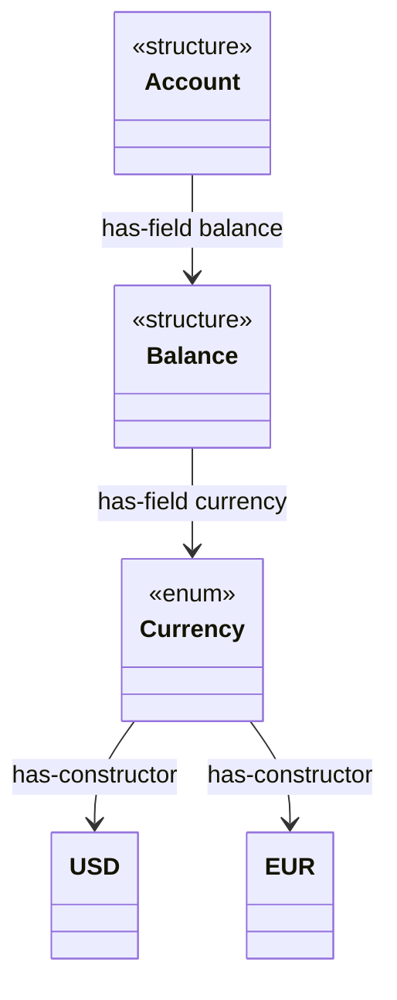

# Type-system diagramming

This reference specifies how to draw the type system that travels through the refinement-driven-development pipeline, and how to keep those drawings honest across the pipeline's stages.
The pipeline visits four objects — Lean 4 → Rust → LLBC → Lean 4 — and each object carries a type system that *should* agree at the boundary they share.
The diagramming methodology turns that agreement into a falsifiable artifact: a single versioned `type-graph.json` populated independently by three emitters, two of which are authoritative (the spec side and the impl side) and one of which is an independent witness (the public-API surface).
Scope discipline for v1 is strict: this file *specifies* the schema and the three emitters, and it *operationalizes* only hand-constructed Mermaid diagrams with an SVG fallback.
The real emitters are future work and are not built in v1.

## Contents

- [The unified type-graph.json schema](#the-unified-type-graphjson-schema)
- [Emitter (i): the Lean Environment metaprogram (ground truth, spec side)](#emitter-i-the-lean-environment-metaprogram-ground-truth-spec-side)
- [Emitter (ii): the charon-ml / LLBC consumer (faithful to what Aeneas verifies, impl side)](#emitter-ii-the-charon-ml--llbc-consumer-faithful-to-what-aeneas-verifies-impl-side)
- [Emitter (iii): rustdoc-types over rustdoc JSON (independent cross-check)](#emitter-iii-rustdoc-types-over-rustdoc-json-independent-cross-check)
- [Reconciling ids across the three emitters](#reconciling-ids-across-the-three-emitters)
- [v1 operational path: hand-constructed Mermaid](#v1-operational-path-hand-constructed-mermaid)
- [SVG fallback for what Mermaid cannot express](#svg-fallback-for-what-mermaid-cannot-express)
- [Future work: the real emitters, the differ, the drift gate](#future-work-the-real-emitters-the-differ-the-drift-gate)

## The unified type-graph.json schema

The three emitters traverse three different intermediate representations, but they describe the same nominal type system.
Rather than three bespoke JSON shapes, this skill specifies *one* node/edge vocabulary that all three populate, so that two graphs can be diffed as data rather than compared as pictures.
The schema is versioned by a single integer `schemaVersion` field at the document root; a consumer asserts the version it understands and refuses unknown ones, exactly as the rustdoc `FORMAT_VERSION` contract instructs (`src/lib.rs:104-117` in `~/projects/rust-workspace/rustdoc-types`).
The v1 schema is `schemaVersion = 1`.

A document is a set of nodes plus a set of edges, tagged with the emitter that produced it and which IR stage the emitter read.

```json
{
  "schemaVersion": 1,
  "emitter": "lean-env",
  "stage": "spec",
  "source": { "tool": "lean", "toolVersion": "4.x", "unit": "Domain" },
  "nodes": [ ... ],
  "edges": [ ... ]
}
```

A node carries a stable string `id`, a `kind` drawn from a closed vocabulary, a display `name`, the originating `module` or path, and an optional `arity` record for type-parameter and index counts.
The closed node-kind vocabulary is `inductive`, `structure`, `enum`, `struct`, `function`, and `instance`.
The vocabulary is intentionally a union over all three IRs: Lean distinguishes `inductive` from `structure` (and surfaces `class`/`class inductive`, which map onto `structure`/`inductive` with an `isClass` flag); Rust and LLBC distinguish `struct` from `enum`; rustdoc supplies the same struct/enum surface.
An emitter populates only the kinds its IR can express and marks the rest absent, never inventing a kind to force agreement.

```json
{
  "id": "lean:Domain.Account",
  "kind": "structure",
  "name": "Account",
  "module": "Domain",
  "arity": { "params": 1, "indices": 0 },
  "attrs": { "isClass": false }
}
```

A node may also carry an `attrs` object for kind-specific flags that do not deserve their own node kind, such as `isClass` for a Lean structure that is also a type class, or `union` for an LLBC union, or `opaque` for a declaration whose body the emitter could not see.
Flags live in `attrs` rather than multiplying the kind vocabulary so that the closed set of six kinds stays small enough to reconcile across emitters that genuinely disagree about how fine to slice the taxonomy.

An edge carries a `kind` from a closed vocabulary, a `from` node id, a `to` node id, and an optional `via` label naming the field or constructor that justifies the edge.
The closed edge-kind vocabulary is `has-field`, `references-type`, `has-constructor`, and `has-instance`.
A `has-field` edge runs from a structure or struct to the type of one of its fields, labelled `via` the field name; a `references-type` edge is the looser dependency edge from any node to a type its signature mentions; a `has-constructor` edge runs from an inductive or enum to each of its constructors or variants; a `has-instance` edge runs from a node carrying `attrs.isClass` (a structure or inductive that is a type class) to an instance node and (separately) from an instance node to each type the instance targets, capturing the class-instance bipartite structure.
The distinction between `has-field` and `references-type` matters for the differ: `has-field` is a structural commitment the three IRs all make precisely, whereas `references-type` is a looser dependency that the spec side reads from a whole type expression and the rustdoc side reads only from resolved nominal paths, so a `references-type` disagreement is weaker evidence of drift than a `has-field` disagreement.

```json
{
  "kind": "has-field",
  "from": "lean:Domain.Account",
  "to": "lean:Domain.Balance",
  "via": "balance"
}
```

The `via` label is what makes a `has-field` edge diffable at field granularity: two emitters can agree that `Account` has a field of type `Balance` while disagreeing about which field name carries it, and only a labelled edge surfaces that disagreement.

## Emitter (i): the Lean Environment metaprogram (ground truth, spec side)

The spec side is ground truth because the Lean 4 declarations *are* the specification the rest of the pipeline refines toward.
The emitter is a `lake exe` metaprogram that walks the elaborated `Lean.Environment` and emits one node per relevant declaration plus the edges its type and constructors imply.
It is not part of the refine/lower, Charon, or Aeneas stages; it consumes the same `Environment` those stages elaborate against, and produces the artifact translation validation later checks against (see `references/check-translation-validation.md`).

The environment is obtained outside elaboration via `importModules ... (leakEnv := true) (loadExts := true)` after `initSearchPath (← findSysroot)`, the recipe doc-gen4 uses (`DocGen4/Load.lean:12-15` and `:21-38` in `~/projects/functional-programming-workspace/lean-doc-gen4`); `loadExts := true` is required because the structure and instance extensions are read below.
The walk iterates `env.constants` (an `SMap` with a `ForIn` instance over `(Name × ConstantInfo)` pairs) inside `MetaM`, run via `Meta.MetaM.toIO`.
The `Environment` structure has changed shape across recent Lean versions, so the emitter goes through the public accessors (`constants`, `find?`, `header`, `getModuleIdxFor?`) and never pattern-matches the structure directly, exactly as doc-gen4 does; a consumer building against an arbitrary toolchain re-confirms these signatures against that toolchain rather than assuming them.

Node population maps `ConstantInfo` variants onto the schema kinds.
The dispatch mirrors doc-gen4's `DocInfo.ofConstant` (`DocGen4/Process/DocInfo.lean:193-209`): a `.inductInfo` becomes `structure` when `isStructure env name` holds and `inductive` otherwise, with the `isClass env name` result recorded in `attrs.isClass` so the `class` and `class inductive` cases are not lost; a `.defnInfo` becomes `function`, or `instance` when `isInstanceCore env name` holds.
The `arity` record reads `InductiveVal.numParams` and `numIndices` directly; the constructor names come from `InductiveVal.ctors`.
A node filter analogous to doc-gen4's `isBlackListed` (`DocInfo.lean:151-165`) drops the compiler-generated `.rec`, `.noConfusion`, `.below`, `.brecOn`, match-equation, and projection auxiliaries, so the graph holds only authored declarations.

Edge population is where the spec side is richest.
A `has-constructor` edge is emitted per name in `InductiveVal.ctors`.
A `has-field` edge per structure field comes from telescoping the field through `getStructureFieldsFlattened env name (includeSubobjectFields := false)`, projecting each field with `mkProjection`, and reading its type with `inferType` — the worked pattern is doc-gen4's `withFields` (`DocGen4/Process/StructureInfo.lean:20-33`); the field's `BinderInfo` from `getFieldInfo?` records implicit-vs-explicit on the edge.
A `references-type` edge per referenced constant comes from `Expr.getUsedConstants` on the declaration's `type` (`Util/FoldConsts.lean:54`), filtered to names that are themselves inductives, structures, or classes so the graph stays type-to-type.
A `has-instance` edge set comes from iterating `(Meta.instanceExtension.getState env).instanceNames`, opening each instance's target with `forallMetaTelescopeReducing` and reading the head constants of the target's arguments — the shape of doc-gen4's `getInstanceTypes` (`DocGen4/Process/InstanceInfo.lean:16-31`).

Serialization uses `Lean.ToJson`: declare the node and edge records and `deriving ToJson, FromJson`, build dynamic-key maps with `Json.mkObj`, and write with `IO.FS.writeFile path (toJson g).pretty`.
An `Option` field whose name ends in `?` is omitted from the JSON when `none` (the documented encoding rule, `Data/Json/FromToJson/Basic.lean:40-73`), which is the idiomatic way to make `via` and `arity` optional.

## Emitter (ii): the charon-ml / LLBC consumer (faithful to what Aeneas verifies, impl side)

The impl side is the second authority, faithful not to the Rust source but to the LLBC that Aeneas actually verifies against.
LLBC is the lowered, monomorphization-aware, body-bearing IR; it is the object the functional translation consumes, so a type graph read from it describes exactly the type system the lifted Lean model will reflect.
The emitter is an OCaml consumer of charon-ml (`~/projects/functional-programming-workspace/charon/charon-ml`), version-locked to the Charon checkout (`0.1.216` at this clone, `charon-ml/src/CharonVersion.ml:3`); the deserializer rejects any LLBC whose version differs (`OfJson.ml:27-34`), so the impl-side graph cannot silently drift from the IR it claims to describe.

The crate is loaded with `OfJson.crate_of_json_file`, yielding a `crate` record whose `type_decls : type_decl TypeDeclId.Map.t` is the node table (`charon-ml/src/GAst.ml:33-47`).
Each `type_decl.kind` is a `type_decl_kind` (`Generated_Types.ml:1234-1247`): `Struct of field list` becomes a `struct` node, `Enum of variant list` becomes an `enum` node, `Union of field list` becomes a `struct` node (with a `union` flag in `attrs`), and `Opaque`/`Alias`/`TDeclError` produce nodes flagged accordingly but with no field edges.
Function declarations in `fun_decls` become `function` nodes; trait impls in `trait_impls` become the impl-side analogue of instances, mapped onto `has-instance` edges from the implemented trait to the type the impl is `for_`.

Edge population traverses the field and variant structure.
For a `Struct`, each `field` (`{ field_name; field_ty; ... }`, `types.rs:603-613`) yields a `has-field` edge labelled `via` the field name — `None` for positional tuple-struct fields, which the schema records as a positional index rather than a name.
For an `Enum`, each `variant` yields a `has-constructor` edge labelled `via` the variant name, and each of that variant's fields yields a nested `has-field` edge so the variant payload is visible.
A field's type is a `ty`; resolving it to an edge target means matching `TyKind`'s `Adt` carrying a `type_decl_ref` whose `id : type_id` (`types.rs:772-797`).
When the `type_id` is `TAdtId tid`, the edge points to `TypeDeclId.Map.find tid crate.type_decls`; when it is `TTuple` or `TBuiltin`, the edge target is a synthetic node for the builtin or tuple rather than a user ADT.
This is the impl-side `references-type` and `has-field` edge derivation, and it is the load-bearing reason the impl graph is faithful: it reads the same `TypeDeclId` integer references Aeneas resolves, not a surface spelling.

A consumer note that affects edge completeness: trait declarations omit provided (defaulted) methods unless they were needed (`gast.rs:316-323`), and the declaration maps serialize as arrays with `null` holes for Invisible items (`Generated_OfJson.ml:77-85`), so the emitter must treat a missing slot as absence, never as an empty type.
A second completeness note concerns hash-consing: by default Charon deduplicates repeated `Ty` and `TraitRef` values, and the OCaml reader resolves the `Untagged`/`HashConsedValue`/`Deduplicated` forms transparently (`Generated_OfJson.ml:46-66`), so the emitter sees fully-resolved types and does not need to handle dedup itself; running `charon` with `--no-dedup-serialized-ast` is a debugging convenience for inspecting the raw JSON, not a requirement for the emitter.
The Charon invocation that produces an LLBC the emitter then reads is the Aeneas-faithful one — `charon cargo --preset aeneas --dest-file <path> -- <cargo args>` — because the impl-side graph must describe the same lowering Aeneas verifies; the exact preset and destination-flag form are documented in `references/lift-charon-aeneas.md` and must match the form there rather than any stale `-o`-style flag.

## Emitter (iii): rustdoc-types over rustdoc JSON (independent cross-check)

The third emitter is deliberately *not* an authority.
It reads the rustdoc JSON produced by `cargo +nightly rustdoc -- --output-format json -Z unstable-options` (`README.md:5-7` in `~/projects/rust-workspace/rustdoc-types`), parsed into a `rustdoc_types::Crate` and gated on `format_version == FORMAT_VERSION` (`57` at this pin).
It exists to provide an independent third witness along a different tool path (rustc's rustdoc) than either authority, so that agreement at the public-API boundary cross-validates the spec and impl emitters without pretending to be verification-faithful ground truth.

Node population reads `Crate::index : HashMap<Id, Item>`; each `Item.inner` is an `ItemEnum` whose snake-cased tag selects the kind (`src/lib.rs:713-830`): `Struct` becomes `struct`, `Enum` becomes `enum`, `Function` becomes `function`, `Trait` becomes the rustdoc analogue of a class.
Edge population resolves the `Vec<Id>` children: `StructKind::Plain { fields, .. }` and the `Tuple`/`Unit` variants give field ids, each resolving to an `Item` whose `inner` is `ItemEnum::StructField(Type)` (`:737-738`), yielding a `has-field` edge; `Enum.variants` give variant ids yielding `has-constructor` edges; a field's `Type` resolves to a `references-type` edge only when it is `ResolvedPath(Path)` carrying an `Id` (`:1394`, `:1485-1525`), because `Primitive` and `Generic` carry only a string name and are not graph nodes.

The rustdoc tag-only `ItemKind` enum (`src/lib.rs:635-711`) carries more variants than the payload-bearing `ItemEnum` because it splits some cases, so the emitter maps through the canonical `ItemEnum::item_kind()` correspondence (`:832-868`) rather than guessing the kind from the tag, and it reads the lightweight `ItemSummary` from `Crate::paths` only for items present there but absent from `index` (the external-item case).

The cross-check is coarse by construction, and the schema records the coarseness rather than hiding it.
Five limits are intrinsic and each maps to a flag the rustdoc emitter sets so the differ can scope comparisons: the graph is privacy-stripped (`Crate::includes_private`, and `has_stripped_fields`/`has_stripped_variants` on containers), so it cannot see private fields the impl side must reason about; lengths, discriminants, and constants are opaque strings, not evaluated semantics; `Id`s are blob-local and non-cross-crate (`:618-633`), so cross-crate references degrade to `ItemSummary` path strings; the `Path.path` spelling is use-site, not definition-site (`:1501-1514`), so only `Path.id` is a reliable identity key; and the format is explicitly unstable with some payloads outside the version guarantee.
A diff that finds the rustdoc graph missing a node the impl graph has is therefore expected when that node is private, and the differ treats such a discrepancy as benign rather than a drift.

## Reconciling ids across the three emitters

The three emitters mint ids in three disjoint namespaces, so the schema prefixes every id with its emitter origin: `lean:Domain.Account`, `llbc:Domain.Account`, `rdoc:Domain.Account`.
No raw integer id is ever used as a cross-emitter key: the LLBC `TypeDeclId` and the rustdoc `Id` are both blob-local integers whose internals must not be parsed (the rustdoc doc comment is explicit, `:625-628`), and the Lean side has no integer id at all.
Reconciliation is therefore by *fully-qualified path*, not by id.

Each emitter records, alongside its prefixed id, a normalized fully-qualified path: the Lean `Name` rendered dotted, the LLBC `Name` (a `Vec<PathElem>` whose first element is the crate name, `names.rs:101`) rendered dotted, and the rustdoc `ItemSummary::path` components joined.
The differ builds a correspondence over these paths and then compares the node kind and the labelled edge set for each corresponding triple.
Path reconciliation is itself fallible — the refine/lower step may rename, and rustdoc paths are use-site spellings — so the differ reports unmatched paths as a third category beside agree and disagree, never forcing a match.
This is why the path is normalized and recorded explicitly per node rather than reconstructed from the id: the id is an opaque key, the path is the join.

## v1 operational path: hand-constructed Mermaid

For v1 the operational deliverable is a hand-constructed Mermaid diagram of the type graph, authored from the schema (or from reading the types directly) rather than emitted by tooling.
Mermaid is the v1 path because it renders in the documentation toolchain without a build step and reads as plain text in version control.
D2 is retired and is not an option for this skill.

A type graph renders as a Mermaid `classDiagram` or a directed `graph`, with node shapes distinguishing kinds and edge labels carrying the `via` field.
A small worked example, an `Account` structure with a `Balance` field and a two-constructor `Currency` enum:



The stereotype (`<<structure>>`, `<<enum>>`) carries the node kind, the arrow labels carry the edge kind and the `via` label, and the structure matches the schema node-for-node and edge-for-edge.
Hand-authoring keeps v1 honest about scope: the diagram is a human artifact derived from the same vocabulary the future emitters will populate, so adopting the emitters later does not change the diagram's vocabulary, only its provenance.

## SVG fallback for what Mermaid cannot express

Mermaid cannot cleanly express some structures the type graph needs: dense generic-argument annotations on edges, the class-instance bipartite overlay where instances target multiple types at once, region or lifetime annotations on `BorrowedRef` field types, or layered layouts that separate the spec-side and impl-side graphs side by side for visual diffing.
For these cases the fallback is a hand-authored SVG, following the conventions in `text-to-visual-iteration` and `scientific-visualization` for the compile-inspect-refine loop and figure conventions.
The SVG is still derived from the schema vocabulary — nodes are the schema nodes, edges are the schema edges — so it remains a view of the same data, not an independent drawing.
The fallback is the exception, not the default; reach for it only when a Mermaid `classDiagram` or `graph` genuinely cannot carry the annotation the diagram needs.

## Future work: the real emitters, the differ, the drift gate

The real emitters — building path (i), (ii), and (iii) as runnable tools — are future work and are explicitly not built in v1.
The design principle for that future work is to decouple metadata acquisition from rendering: each emitter writes the intermediate `type-graph.json`, and a separate renderer turns a graph document into Mermaid or SVG.
Diffing then happens on the data, never on rendered pixels, which is the whole reason the three emitters share one schema.
A differ consumes two `type-graph.json` documents, reconciles their nodes by normalized path (per the reconciliation section above), and reports three categories per correspondence: agree, disagree (node kind or labelled edge set differs), and unmatched (path present in one document only, scoped by the rustdoc coarseness flags so privacy-stripped absences are benign).

All emitted artifacts belong in a gitignored output subdirectory of the working tree; nothing under it is version-controlled, because the artifacts are derived data regenerable from the spec, the crate, and the rustdoc JSON.
This is described here conceptually only — v1 builds no output directory and no emitter.

The eventual drift gate composes the differ into continuous verification: a check that regenerates the spec-side and impl-side graphs, diffs them, and fails when a disagreement appears that is not on an explicit allowlist.
The allowlist is an *admit ledger* — a recorded, justified list of known, accepted divergences between the spec graph and the impl graph, analogous to the admit ledger a proof effort keeps for `sorry`-shaped gaps (see `references/check-translation-validation.md` for the refinement-vs-equivalence framing the gate would enforce).
The drift gate and the admit ledger, like CI integration and `lean-lsp-mcp`, are out of scope for v1 and are recorded here only as clearly-marked future work; the v1 contribution is the schema and the emitter specifications, which are what make the gate buildable later.
