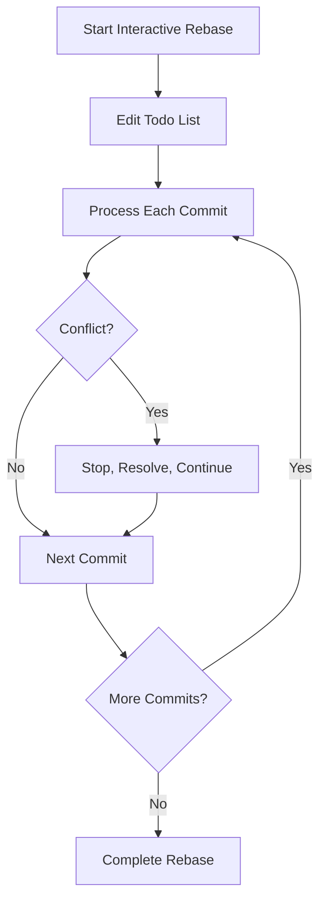
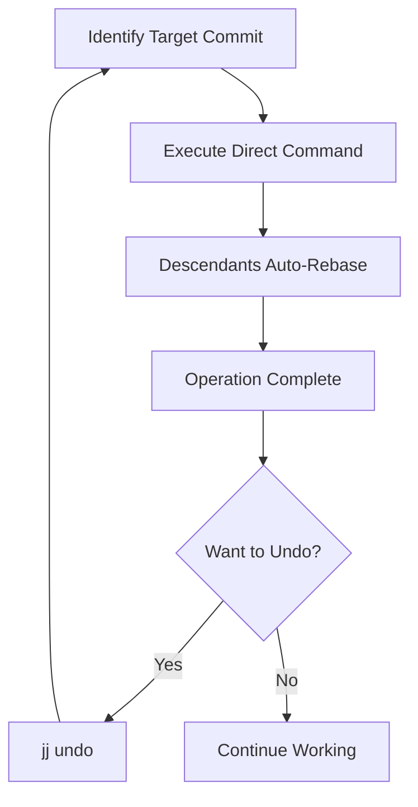
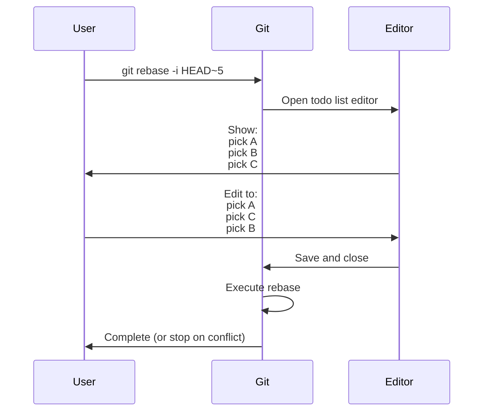
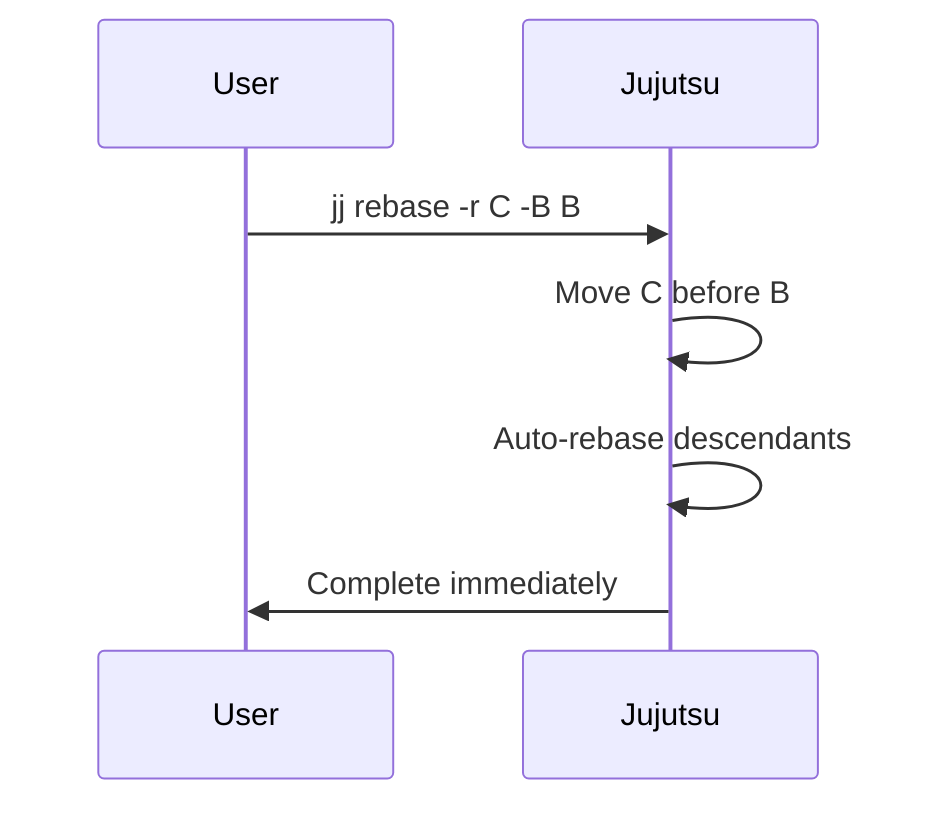
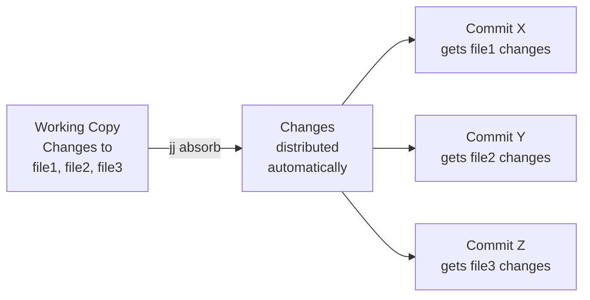

# Complete Reference: Git Interactive Rebase to Jujutsu

A comprehensive guide for Git users transitioning to Jujutsu, mapping all interactive rebase operations to their jj equivalents and beyond.

## Table of Contents

1. [Core Concept: The Paradigm Shift](#core-concept-the-paradigm-shift)
2. [Complete Operation Mapping](#complete-operation-mapping)
3. [Visual Comparison Workflows](#visual-comparison-workflows)
4. [Beyond Git: Jujutsu's Advanced Capabilities](#beyond-git-jujutsus-advanced-capabilities)
5. [Practical Examples](#practical-examples)
6. [Quick Reference Tables](#quick-reference-tables)

---

## Core Concept: The Paradigm Shift

### Git's Interactive Rebase Model



In Git, interactive rebase is a **batch operation** where you:
1. Enter a special mode (`git rebase -i`)
2. Edit a todo list in an editor
3. Execute all operations sequentially
4. Handle interruptions with `--continue`, `--abort`, or `--skip`
5. Cannot make additional changes without restarting

### Jujutsu's Direct Editing Model



In Jujutsu, there is **no special mode**:
1. Commands operate directly on any commit in the history
2. Descendants are automatically rebased when ancestors change
3. Every operation is atomic and immediately undoable
4. Conflicts are committed and can be resolved later
5. You never leave the normal working state

**The fundamental insight**: In jj, every commit operation is non-interactive by default, making "interactive rebase" as a concept obsolete.

---

## Complete Operation Mapping

### Basic Operations

| Git Interactive Rebase | What It Does | Jujutsu Command | Key Differences |
|------------------------|--------------|-----------------|-----------------|
| `pick <commit>` | Keep commit as-is | *(automatic)* | All commits are "picked" by default; use `jj new <commit>` to build on top |
| `reword <commit>` | Edit commit message | `jj describe -r <commit> -m "message"` | Can reword any commit directly without entering special mode |
| `edit <commit>` | Stop to modify commit | `jj edit <commit>` | Checks out commit immediately; changes automatically amend it |
| `squash <commit>` | Merge into parent (keep both messages) | `jj squash -r <commit>` | Moves changes from commit into parent; descendants auto-rebase |
| `fixup <commit>` | Merge into parent (discard message) | `jj squash -r <commit>` | jj doesn't distinguish fixup from squash; both discard the source message by default |
| `fixup -c <commit>` | Merge, use fixup message | `jj squash -r <commit> -m "message"` | Specify message explicitly with `-m` |
| `fixup -C <commit>` | Merge, use fixup message, no edit | `jj squash -r <commit>` | Default behavior when commit has a description |
| `drop <commit>` | Remove commit entirely | `jj abandon <commit>` | Abandons commit; descendants rebased onto grandparent(s) |
| `exec <command>` | Run shell command at this point | *(no direct equivalent)* | Use `jj log` + shell script, or test after each change and `jj undo` if needed |
| `break` | Pause to make changes | *(not needed)* | All operations are atomic; never in "rebasing mode" |
| `label <name>` | Mark a point in history | `jj bookmark create <name> -r <commit>` | Creates a bookmark (jj's term for Git branches) |
| `reset <label>` | Move to labeled point | `jj new <bookmark>` or `jj edit <bookmark>` | `new` creates new commit on top; `edit` checks out bookmark |
| `merge <branches>` | Create merge commit | `jj new <parent1> <parent2> ...` | Multiple parents create a merge; supports n-way merges |

### Advanced Operations

| Operation | Git Interactive Rebase | Jujutsu Command | Notes |
|-----------|----------------------|-----------------|-------|
| **Reorder commits** | Reorder lines in todo list | `jj rebase -r <commit> -A <target>` or `-B <target>` | `-A` = insert after; `-B` = insert before; descendants follow |
| **Split commit** | Mark "edit", reset, stage, commit | `jj split -r <commit>` | Opens TUI to select changes for first commit; remainder becomes second |
| **Partial squash** | Stage subset, commit --amend | `jj squash -i -r <commit>` | Interactive diff editor to select hunks to move |
| **Move to specific ancestor** | fixup + reorder + exec | `jj squash --from <commit> --into <ancestor>` | Can target any ancestor, not just parent |
| **Move between any commits** | *(not possible)* | `jj squash --from <src> --into <dest>` | Works on any two commits in history |
| **Edit without checkout** | *(not possible)* | `jj diffedit -r <commit>` | Edit commit's diff directly in editor without checking out |
| **Auto-absorb changes** | *(not possible)* | `jj absorb` | Automatically distributes working copy changes to appropriate ancestors |
| **Keep empty after squash** | *(not possible)* | `jj squash --keep-emptied` | Preserves source commit after moving changes |

### Conflict Resolution

| Git Interactive Rebase | Jujutsu Equivalent |
|------------------------|-------------------|
| Rebase stops with conflict markers | Conflict is committed; marked as "conflict" in log |
| `git add <file>` | *(automatic - jj tracks all files)* |
| `git rebase --continue` | *(not needed - never in special mode)* |
| `git rebase --abort` | `jj undo` or `jj op restore <operation>` |
| `git rebase --skip` | `jj abandon <commit>` (to skip applying a commit) |
| Resolve before continuing | `jj new <conflicted>`, resolve, `jj squash` into conflicted commit |
| `git mergetool` | `jj resolve` (launches merge tool for each conflict) |

---

## Visual Comparison Workflows

### Workflow 1: Reordering Commits

**Git Interactive Rebase:**


**Jujutsu Direct Command:**


### Workflow 2: Squashing Multiple Commits

**Git:**
```
A - B - C - D - E (HEAD)
Goal: Combine C, D, E into one commit

git rebase -i HEAD~5
# Change todo list:
pick A
pick B
pick C
squash D
squash E
```

**Jujutsu:**
```
A - B - C - D - E (@)
Goal: Same

jj squash -r @      # E squashed into D, @ now points to D
jj squash -r @      # D squashed into C, @ now points to C
# Result: A - B - C (@)
```

Or more directly:
```bash
# From E, squash everything into C
jj squash --from @ --into C
jj squash --from @- --into C
```

---

## Beyond Git: Jujutsu's Advanced Capabilities

These features have no equivalent in Git's interactive rebase and represent jj's advanced capabilities.

### 1. Operation Log - Complete History Tracking

**What Git has:**
- Per-ref reflog (`git reflog`)
- Limited to tracking HEAD and branch movements
- Cannot undo complex multi-ref operations atomically

**What Jujutsu has:**
```bash
jj op log              # See all operations performed on repository
jj op show <id>        # Show what an operation changed
jj undo                # Undo last operation (any operation!)
jj op restore <id>     # Restore repo to any previous state
```

**Example:**
```bash
$ jj log -r @
@  abc123 feat: add feature X

$ jj describe -m "feat: add feature Y"  # Oops, wrong message
$ jj squash                              # Oops, didn't mean to squash
$ jj rebase -d main                      # Oops, wrong base

$ jj op log
@  def456 ... rebase
○  ghi789 ... squash
○  jkl012 ... describe
○  mno345 ... [original state]

$ jj undo                # Undoes rebase
$ jj undo                # Undoes squash
$ jj undo                # Undoes describe - back to original!
```

### 2. Parallel History Editing

**Git limitation:** Can only edit one commit at a time in interactive rebase mode.

**Jujutsu capability:** Edit multiple commits in parallel:

```bash
# Reword multiple commits simultaneously
jj describe -r A -m "Fix typo in A"
jj describe -r B -m "Fix typo in B"
jj describe -r C -m "Fix typo in C"

# Split multiple commits
jj split -r X
jj split -r Y
jj split -r Z

# All operations execute immediately and independently
```

### 3. Absorb - Intelligent Change Distribution

```bash
# Make changes to multiple files
echo "fix" >> file1.txt
echo "improvement" >> file2.txt
echo "refactor" >> file3.txt

# Automatically move each change to the commit that last touched those lines
jj absorb

# jj analyzes blame information and distributes changes appropriately
```

**Visual representation:**


### 4. Working Copy Commit

The working copy is always a commit:

```bash
jj log
@  work-in-progress   # Working copy is always a commit
○  finished-feature
○  main

# No "git add" needed - all changes are tracked
# No "git commit --amend" needed - changes automatically amend @
# No "git stash" needed - just create new commit with jj new
```

### 5. Conflicted Commits

```bash
# After a rebase that would conflict in Git:
jj log
@  abc123 (conflict) attempted merge
○  def456 feature branch
○  ghi789 main

# Work continues normally - conflict is just marked
jj new               # Create new commit on top of conflict
jj new other-commit  # Or work on something else
jj edit abc123       # Come back to resolve conflict later
```

### 6. Flexible Targeting

```bash
# Move changes between ANY two commits (not just parent/child)
jj squash --from <commit-A> --into <commit-B>

# Insert commit anywhere in history
jj rebase -r X -A Y -B Z    # Insert X after Y and before Z

# Duplicate commits to multiple locations
jj duplicate <commit> -d <dest1>
jj duplicate <commit> -d <dest2>
```

### 7. Revsets - Powerful Commit Selection

```bash
# Select multiple commits with expressions
jj rebase -s 'author("alice")' -d main          # All commits by Alice
jj abandon 'empty()'                             # All empty commits
jj squash -r 'description(glob:"WIP:*")'        # All WIP commits
jj log -r 'mine() & ~bookmarks()'               # My commits not on bookmarks
```

### 8. Evolution Log

Track how a single change evolved:

```bash
jj evolog -r <commit>    # See all versions of this commit
jj evolog -p             # With diffs showing what changed each time

# Shows history of amendments, rebases, descriptions, etc.
```

---

## Practical Examples

### Example 1: Clean Up a Feature Branch

**Scenario:** You have 10 commits with several "WIP" commits, typo fixes, and changes that should be reordered.

**Git approach:**
```bash
git rebase -i main
# Manually edit todo list:
# - Reorder commits
# - Mark several commits as "fixup"
# - Mark one as "edit" to split
# Deal with conflicts at each step
git rebase --continue (multiple times)
```

**Jujutsu approach:**
```bash
# Reword WIP commits
jj describe -r <commit1> -m "proper message"
jj describe -r <commit2> -m "another proper message"

# Squash fixup commits
jj squash -r <fixup-commit1>
jj squash -r <fixup-commit2>

# Reorder if needed
jj rebase -r X -B Y

# Split a commit
jj split -r <large-commit>

# All done! Each command executes immediately
# Use jj undo at any point if you make a mistake
```

### Example 2: Fix a Bug in an Earlier Commit

**Git approach:**
```bash
# Make fix
git add <files>
git commit --fixup=<commit-to-fix>
git rebase -i --autosquash <base>
# Interactive rebase executes
```

**Jujutsu approach:**
```bash
# Approach 1: Direct edit
jj edit <commit-to-fix>
# Make changes
# Changes automatically amend the commit
jj new @-  # Return to where you were

# Approach 2: From working copy
# Make changes in working copy
jj squash --into <commit-to-fix>

# Approach 3: Interactive selection
jj squash -i --into <commit-to-fix>
```

### Example 3: Rebase Complex Branch Structure

**Scenario:**
```
    C - D - E (feature-v2)
   /
  B (feature-v1)
 /
A (main)

Want to rebase feature-v2 directly onto A
```

**Git approach:**
```bash
git rebase --onto A B feature-v2
# OR
git rebase -i A
# Manually drop commits from feature-v1
```

**Jujutsu approach:**
```bash
# Approach 1: Direct rebase
jj rebase -s C -d A

# Approach 2: Using revset
jj rebase -s 'B..feature-v2' -d A

# Result:
# A - C' - D' - E' (feature-v2)
#  \
#   B (feature-v1)
```

### Example 4: Recover from Mistakes

**Scenario:** You ran several operations and realized the third operation was wrong.

**Git approach:**
```bash
# Very difficult without reflog expertise
git reflog
git reset --hard HEAD@{5}  # Hope you count correctly
# Lost all subsequent work
```

**Jujutsu approach:**
```bash
jj op log
#  @  op4 ... latest operation
#  ○  op3 ... the mistaken operation
#  ○  op2 ...
#  ○  op1 ...

jj undo       # Undoes op4
jj undo       # Undoes op3 (the mistake)
jj op restore op4  # Restores op4
# Now have: op1, op2, op4 (op3 was removed)

# Or restore to exact state:
jj op restore <op-before-mistake>
```

### Example 5: Split Commit by File

**Git approach:**
```bash
git rebase -i <commit>^
# Mark commit as "edit"
git reset HEAD^
git add file1.txt
git commit -m "Part 1"
git add file2.txt
git commit -m "Part 2"
git rebase --continue
```

**Jujutsu approach:**
```bash
# By path specification:
jj split -r <commit> file1.txt
# file1.txt goes to first commit
# file2.txt stays in second commit

# Or interactively:
jj split -i -r <commit>
# TUI to select changes
```

---

## Quick Reference Tables

### Operation Categories

#### Message Editing

| Task | Jujutsu Command |
|------|----------------|
| Change commit message | `jj describe -r <commit> -m "message"` |
| Open editor for message | `jj describe -r <commit>` |
| Change author | `jj describe -r <commit> --author "Name <email>"` |
| Reset author to self | `jj describe -r <commit> --reset-author` |

#### Commit Combination

| Task | Jujutsu Command |
|------|----------------|
| Squash into parent | `jj squash -r <commit>` |
| Squash partial into parent | `jj squash -i -r <commit>` |
| Squash into specific ancestor | `jj squash --from <commit> --into <ancestor>` |
| Squash between any commits | `jj squash --from <src> --into <dest>` |
| Keep empty after squash | `jj squash -r <commit> --keep-emptied` |
| Auto-squash to right places | `jj absorb` |

#### Commit Division

| Task | Jujutsu Command |
|------|----------------|
| Split commit interactively | `jj split -r <commit>` |
| Split by paths | `jj split -r <commit> <paths>` |
| Create new commit on top | `jj new <commit>` |
| Move working copy changes to new commit | `jj commit` |
| Move specific paths to new commit | `jj commit <paths>` |

#### History Rewriting

| Task | Jujutsu Command |
|------|----------------|
| Remove commit | `jj abandon <commit>` |
| Edit commit directly | `jj edit <commit>` |
| Edit commit without checkout | `jj diffedit -r <commit>` |
| Duplicate commit | `jj duplicate <commit>` |
| Duplicate to specific location | `jj duplicate <commit> -d <dest>` |

#### Commit Reordering & Moving

| Task | Jujutsu Command |
|------|----------------|
| Move commit after target | `jj rebase -r <commit> -A <target>` |
| Move commit before target | `jj rebase -r <commit> -B <target>` |
| Move commit to new parent | `jj rebase -r <commit> -d <parent>` |
| Move commit tree | `jj rebase -s <commit> -d <dest>` |
| Move branch to new base | `jj rebase -b <branch> -d <dest>` |

#### Conflict Management

| Task | Jujutsu Command |
|------|----------------|
| See conflicted files | `jj status` or `jj log -r 'conflict()'` |
| Start resolving conflicts | `jj new <conflicted-commit>` |
| Resolve with merge tool | `jj resolve` |
| List conflicts | `jj resolve --list` |
| Move resolution into conflicted commit | `jj squash` |

#### Undo Operations

| Task | Jujutsu Command |
|------|----------------|
| Undo last operation | `jj undo` |
| See operation history | `jj op log` |
| Restore to specific operation | `jj op restore <operation>` |
| View changes in operation | `jj op show <operation>` |
| Create reverse commit (git revert) | `jj revert -r <commit> -d <target>` |

### Common Patterns

#### "I want to edit commit X"

```bash
jj edit X              # Checkout X, changes amend it
# ... make changes ...
# Changes automatically amend X
```

#### "I want to add these changes to commit X"

```bash
# Make changes in working copy
jj squash --into X
```

#### "I want to split commit X by hunks"

```bash
jj split -i -r X
```

#### "I want to combine commits A, B, and C"

```bash
jj squash -r C         # C → B
jj squash -r B         # B → A
# Result: One commit at A with all changes
```

#### "I want to reorder A-B-C to A-C-B"

```bash
jj rebase -r C -B B
```

#### "I want to move commit X to a different branch"

```bash
jj rebase -r X -d <other-branch>
```

#### "I messed up, undo everything"

```bash
jj undo                          # Undo last operation
jj undo                          # Undo one more
jj op restore <operation-id>     # Go back to specific state
```

---

## Command Flag Reference

### `jj rebase` flags

| Flag | Meaning | Example |
|------|---------|---------|
| `-r <revset>` | Rebase only specified commits | `jj rebase -r X -d Y` |
| `-s <revset>` | Rebase commit and descendants | `jj rebase -s X -d Y` |
| `-b <revset>` | Rebase branch (revs from base) | `jj rebase -b X -d Y` |
| `-d <revset>` | Destination (new parent) | `jj rebase -r X -d Y` |
| `-A <revset>` | Insert after (and rebase children) | `jj rebase -r X -A Y` |
| `-B <revset>` | Insert before (and rebase children) | `jj rebase -r X -B Y` |

### `jj squash` flags

| Flag | Meaning | Example |
|------|---------|---------|
| `-r <revset>` | Squash this commit into parent | `jj squash -r X` |
| `--from <revset>` | Source of changes | `jj squash --from X --into Y` |
| `--into <revset>` | Destination of changes | `jj squash --into Y` |
| `-i` | Interactive (select hunks) | `jj squash -i -r X` |
| `-m <message>` | Set description | `jj squash -r X -m "msg"` |
| `--keep-emptied` | Keep empty source commit | `jj squash -r X --keep-emptied` |
| `<paths>` | Squash only these paths | `jj squash file1.txt file2.txt` |

### `jj new` flags

| Flag | Meaning | Example |
|------|---------|---------|
| `<revset>` | Parent(s) of new commit | `jj new X` or `jj new X Y` (merge) |
| `-m <message>` | Set description | `jj new X -m "Start feature"` |
| `-A <revset>` | Insert after | `jj new -A X` |
| `-B <revset>` | Insert before | `jj new -B X` |
| `--no-edit` | Don't edit new commit | `jj new X --no-edit` |

---

## Summary: Why Jujutsu Doesn't Need Interactive Rebase

**Git's interactive rebase exists because:**
1. The working copy is not a commit
2. You need a staging area to prepare commits
3. History editing requires entering a special mode
4. Operations are batched and executed sequentially
5. Conflicts pause the entire process

**Jujutsu eliminates these needs by:**
1. Making the working copy a commit (`@`)
2. Eliminating the staging area
3. Making every command operate directly on history
4. Executing each operation immediately and atomically
5. Committing conflicts and allowing later resolution
6. Auto-rebasing descendants of changed commits
7. Providing operation-level undo for any mistake

**The result:** Every operation you'd use interactive rebase for in Git is a direct, immediate command in jj. You never enter a special mode, never need to continue or abort, and can undo anything instantly.

This document serves as a complete reference for transitioning from Git's interactive rebase to Jujutsu's direct commit editing model.
