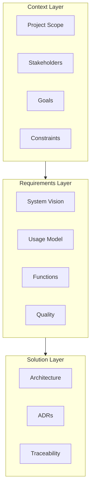

Development documentation organized using AMDiRE (Architecture, Monitoring, Development, Integration, Release, Evaluation) principles.

The documentation follows AMDiRE's three-layer structure:

## Context layer

Problem domain documentation capturing the environment in which the system operates.

- [Context](/development/context/) - Project scope, stakeholders, goals, constraints, domain model, and glossary

## Requirements layer

Black-box specification of what the system should do from a user perspective.

- [Requirements](/development/requirements/) - System vision, usage model, functional hierarchy, and quality requirements

## Solution layer

Technical design and implementation documentation.

- [Architecture](/development/architecture/) - Architectural decisions and technical design documentation
- [Traceability](/development/traceability/) - Requirements traceability and CI/CD philosophy
