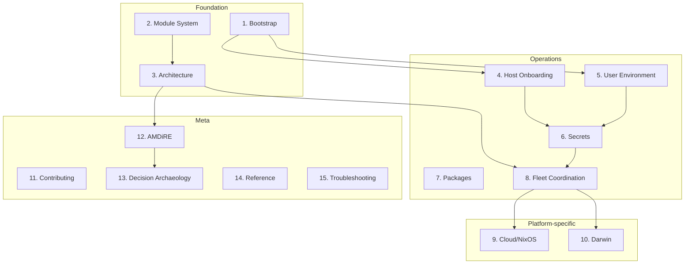
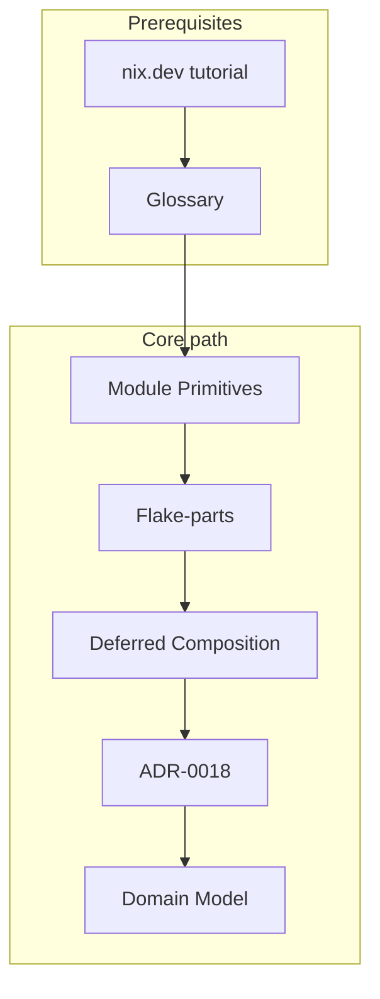

This page provides curated reading paths through the documentation based on your current goals.
Each path sequences documents to build understanding progressively, ensuring prerequisites appear before advanced material.
Use these paths when you want a structured approach rather than browsing individual pages.

To use this page effectively, first identify your goal from the path names below.
The path overview diagram shows how paths relate, so you can see if foundational paths should be completed first.
Then follow the numbered document list in order, skipping items you already understand.

## Path overview

The following diagram shows how the 15 learning paths relate to each other.
Foundation paths (1-3) support operational paths (4-8), which in turn enable platform-specific paths (9-10).
Meta paths (11-15) can be entered at any point depending on your needs.

## Path 1: First-time bootstrap

For users setting up their first machine with this infrastructure.
This path takes you from initial installation through understanding the repository structure and common operations.

1. [Getting started](/guides/getting-started/) - Bootstrap nix and tools
2. [Bootstrap to Activation](/tutorials/bootstrap-to-activation/) - Understand the full bootstrap process
3. [Repository Structure](/reference/repository-structure/) - Familiarize with layout
4. [Architecture Overview](/concepts/architecture-overview/) - High-level understanding
5. [Justfile Recipes](/reference/justfile-recipes/) - Common operations reference

## Path 2: Module system foundations

For users wanting to understand the algebraic and category-theoretic foundations enabling Nix configuration composition.
This path covers how the module system enables declarative composition through fixpoint computation and deferred evaluation.

The following diagram shows the structure of this path, including optional prerequisites and the core reading sequence.

### Prerequisites

Skip this section if you are already comfortable writing basic Nix modules with `mkOption`, `mkEnableOption`, and the `{ config, lib, ... }:` pattern.

1. External: [nix.dev module system tutorial](https://nix.dev/tutorials/module-system/index.html) - Basic module writing with mkOption, mkEnableOption, and the `{ config, lib, ... }:` pattern
2. [Glossary](/development/context/glossary/) - Terminology orientation (especially: module system, deferredModule, evalModules, fixpoint entries)

### Core path

3. [Module System Primitives](/concepts/module-system-primitives/) - deferredModule, evalModules, fixpoint computation
4. [Flake-parts and the Module System](/concepts/flake-parts-module-system/) - How flake-parts wraps evalModules
5. [Deferred Module Composition](/concepts/deferred-module-composition/) - Aspect-based organization pattern
6. [ADR-0018: Dendritic flake-parts architecture](/development/architecture/adrs/0018-dendritic-flake-parts-architecture/) - Decision rationale
7. [Domain Model](/development/context/domain-model/) - Nix ecosystem conceptual model

## Path 3: Architecture understanding

For users wanting to comprehend the full system design across all four architectural layers.
This path builds from overview to detailed specification, covering each layer in sequence.

1. [Architecture Overview](/concepts/architecture-overview/) - Four-layer architecture summary
2. [Module System Primitives](/concepts/module-system-primitives/) - Layer 0 foundations
3. [Flake-parts and the Module System](/concepts/flake-parts-module-system/) - Layer 1 framework
4. [Deferred Module Composition](/concepts/deferred-module-composition/) - Layer 2 organization
5. [Clan Integration](/concepts/clan-integration/) - Layer 3 multi-machine coordination
6. [Architecture specification](/development/architecture/architecture/) - Full AMDiRE system specification
7. [ADRs index](/development/architecture/adrs/) - Browse all architectural decisions

## Path 4: Host onboarding

For users adding new Darwin or NixOS machines to the fleet.
This path covers the procedural steps and conceptual understanding needed for machine registration.

1. [Host Onboarding](/guides/host-onboarding/) - Step-by-step procedure (Darwin vs NixOS sections)
2. [Secrets Setup](/tutorials/secrets-setup/) - Required for host secrets
3. [System-User Integration](/concepts/system-user-integration/) - Admin vs standalone user patterns
4. [Clan Integration](/concepts/clan-integration/) - Machine registry and deployment
5. [Deployment Requirements](/development/requirements/deployment-requirements/) - Platform-specific deployment details

## Path 5: User environment setup

For users setting up home-manager configurations for their user accounts.
This path explains both the operational steps and the conceptual model for user-level configuration.

1. [Home-Manager Onboarding](/guides/home-manager-onboarding/) - User environment setup
2. [System-User Integration](/concepts/system-user-integration/) - Admin-integrated vs standalone users
3. [Deferred Module Composition](/concepts/deferred-module-composition/) - Understanding home module organization
4. [Secrets Management](/guides/secrets-management/) - User-level secrets

## Path 6: Secrets management

For users working with encrypted secrets and credentials.
This path covers both operational procedures and the architectural decisions behind the secrets system.

1. [Secrets Management](/guides/secrets-management/) - Operational guide
2. [Secrets Setup](/tutorials/secrets-setup/) - Foundational understanding
3. [Clan Integration](/concepts/clan-integration/) - Secrets architecture section
4. [ADR-0011: SOPS secrets management](/development/architecture/adrs/0011-sops-secrets-management/) - Original sops-nix decision
5. [ADR-0019: Clan-core orchestration](/development/architecture/adrs/0019-clan-core-orchestration/) - Clan vars migration context

## Path 7: Package management and stability

For users handling nixpkgs breakage and custom packages.
This path explains the overlay system and multi-channel architecture that enables stable package fallbacks.

1. [Handling Broken Packages](/guides/handling-broken-packages/) - Stable fallback procedures
2. [Adding Custom Packages](/guides/adding-custom-packages/) - pkgs-by-name pattern
3. [Architecture Overview](/concepts/architecture-overview/) - Multi-channel overlay section
4. [ADR-0003: Overlay composition patterns](/development/architecture/adrs/0003-overlay-composition-patterns/) - Original overlay design
5. [ADR-0017: Dendritic overlay patterns](/development/architecture/adrs/0017-dendritic-overlay-patterns/) - Current overlay architecture

## Path 8: Multi-machine fleet coordination

For users managing deployments across multiple hosts.
This path covers the clan-based coordination system and its integration with the dendritic architecture.

1. [Clan Integration](/concepts/clan-integration/) - Core coordination concepts
2. [Architecture Overview](/concepts/architecture-overview/) - Fleet overview and integration points
3. [ADR-0019: Clan-core orchestration](/development/architecture/adrs/0019-clan-core-orchestration/) - Orchestration decision
4. [ADR-0020: Dendritic + Clan integration](/development/architecture/adrs/0020-dendritic-clan-integration/) - Pattern integration
5. [Usage Model](/development/requirements/usage-model/) - UC-004: Coordinated service deployment
6. [Functional Hierarchy](/development/requirements/functional-hierarchy/) - MC-* multi-host coordination functions

## Path 9: Cloud infrastructure provisioning

For users deploying NixOS to cloud providers such as Hetzner or GCP.
This path covers the terranix-based infrastructure provisioning and its integration with clan.

1. [NixOS Deployment](/tutorials/nixos-deployment/) - Cloud deployment tutorial
2. [ADR-0021: Terranix infrastructure provisioning](/development/architecture/adrs/0021-terranix-infrastructure-provisioning/) - IaC decision
3. [Clan Integration](/concepts/clan-integration/) - Terranix + Clan integration
4. [Usage Model](/development/requirements/usage-model/) - UC-001: Bootstrap new host
5. [Deployment Requirements](/development/requirements/deployment-requirements/) - DR-002: NixOS deployment

## Path 10: Darwin (macOS) deployment

For macOS-specific configuration and deployment.
This path covers the complete Darwin workflow from initial setup through platform-specific considerations.

1. [Darwin Deployment](/tutorials/darwin-deployment/) - Complete darwin workflow
2. [Host Onboarding](/guides/host-onboarding/) - Darwin section
3. [Architecture Overview](/concepts/architecture-overview/) - Platform support table
4. [Deployment Requirements](/development/requirements/deployment-requirements/) - DR-001: Darwin deployment
5. [System Constraints](/development/requirements/system-constraints/) - SC-004: Platform-specific constraints

## Path 11: Contributor and developer

For contributors to this infrastructure codebase.
This path covers contribution guidelines, testing practices, and CI/CD architecture.

1. [Contributing Index](/about/contributing/) - Guidelines overview
2. [Commit Conventions](/about/contributing/commit-conventions/) - Commit format
3. [Testing](/about/contributing/testing/) - Test framework
4. [CI/CD Setup](/about/contributing/ci-cd-setup/) - Pipeline details
5. [CI Philosophy](/development/traceability/ci-philosophy/) - CI design principles
6. [ADR-0012: GitHub Actions pipeline](/development/architecture/adrs/0012-github-actions-pipeline/) - CI architecture decision
7. [ADR-0016: Per-job content-addressed caching](/development/architecture/adrs/0016-per-job-content-addressed-caching/) - Cache strategy

## Path 12: AMDiRE development methodology

For users wanting to understand the requirements engineering approach used in this project.
This path follows the AMDiRE layer structure from context through requirements to architecture.

1. [Development Index](/development/) - AMDiRE overview
2. [Context Index](/development/context/) - Problem domain documentation
   - [Project Scope](/development/context/project-scope/)
   - [Stakeholders](/development/context/stakeholders/)
   - [Goals and Objectives](/development/context/goals-and-objectives/)
   - [Constraints and Rules](/development/context/constraints-and-rules/)
   - [Domain Model](/development/context/domain-model/)
   - [Glossary](/development/context/glossary/)
3. [Requirements Index](/development/requirements/) - Black-box specification
   - [System Vision](/development/requirements/system-vision/)
   - [Usage Model](/development/requirements/usage-model/)
   - [Functional Hierarchy](/development/requirements/functional-hierarchy/)
   - [Quality Requirements](/development/requirements/quality-requirements/)
4. [Architecture Index](/development/architecture/) - Solution space
5. [Traceability Index](/development/traceability/) - Requirements tracing

## Path 13: Decision archaeology

For users wanting to understand why specific technical decisions were made.
This path provides both chronological access and thematic clusters of related decisions.

1. [ADRs Index](/development/architecture/adrs/) - All decisions chronologically
2. Thematic ADR clusters:
   - Nix fleet: ADR-0017 to ADR-0018 to ADR-0019 to ADR-0020 to ADR-0021
   - CI/CD evolution: ADR-0012 to ADR-0015 to ADR-0016
   - Overlay patterns: ADR-0003 to ADR-0017
   - Monorepo structure: ADR-0004 to ADR-0005 to ADR-0006 to ADR-0007 to ADR-0008
3. [Goals and Objectives](/development/context/goals-and-objectives/) - What decisions serve
4. [Quality Requirements](/development/requirements/quality-requirements/) - Quality drivers

## Path 14: Quick reference lookup

For users needing immediate command or configuration reference.
This path collects the reference materials for quick access during daily operations.

1. [Justfile Recipes](/reference/justfile-recipes/) - Task runner commands
2. [Flake Apps](/reference/flake-apps/) - Nix activation commands
3. [CI Jobs](/reference/ci-jobs/) - CI job reference and local equivalents
4. [Repository Structure](/reference/repository-structure/) - Directory layout
5. [Glossary](/development/context/glossary/) - Terminology definitions

## Path 15: Troubleshooting and operations

For users debugging issues or performing maintenance.
This path collects troubleshooting resources and operational documentation.

1. [Troubleshooting CI Cache](/development/operations/troubleshooting-ci-cache/) - CI cache issues
2. [Handling Broken Packages](/guides/handling-broken-packages/) - Package breakage resolution
3. [CI Jobs](/reference/ci-jobs/) - Job reference with troubleshooting
4. [Test Harness](/development/traceability/test-harness/) - Testing infrastructure
5. [System Constraints](/development/requirements/system-constraints/) - Known limitations

## Path relationships

The paths in this guide form a coherent whole organized around the architecture's four layers.
Foundation paths establish the conceptual groundwork that operational paths build upon.
Platform-specific paths specialize the operational knowledge for particular deployment targets.
Meta paths provide cross-cutting concerns like contribution guidelines and decision rationale that support work at any level.

Return to the path overview diagram at the top of this page to visualize these relationships and plan your reading accordingly.
